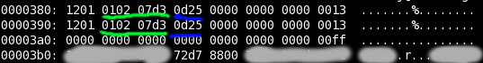

<b>Reverse Engineering the   (old) OVGU Student Card</b>
===========================================================

 

<table><tr>
    <td></td>
    <td width="10%"></td>
    <td></td>
</tr></table>

Yomin @ Netz39

# Presenter Notes

difference between Mifare Classic and zombies?
no one, both run around despite beeing long dead

---

Why
=====

- 27C3: Harald Welte: Reverse engineering a real-world RFID payment system
- LeSpockys [post](http://blog.antiblau.de/2008/04/29/sicherheitsluecken-beim-studentenausweis-der-ovgu)
  in his blog at the time the system was freshly broken
- curiosity, what else

Intercard Statement ([link](http://www.intercard.org/de/home/news_2008_04_07.pdf))
-----------------------

> Die einfache Struktur der aufgedeckten Rechenregel, voraussagbare Zufallszahlen sowie
> Zusammenhänge zwischen Karten-ID und Schlüssel lassen einen erfolgreichen Angriff auf
> die Karte gewissermaßen recht einfach erscheinen.
> 
> Die Aussage "Verschlüsselungsalgorithmus Mifare Classic nachvollzogen" muss also
> im Grundsatz als korrekt bewertet werden!
> 
> [...]
> 
> Diese kriminelle Energie könnte zu einem Missbrauch verwendet werden, wodurch
> wirtschaftliche Schäden entstehen können.

---

Mifare
======

- Mikron Gesellschaft für Integrierte Mikroelektronik
- 1990 Mikron Fare System
- 1995 Phillips Semiconductors
- 2006 NXP Semiconductors
- ISO/IEC 14443 Type A 13.56 MHz (<= 10cm)
- variants: Classic, Ultralight, DESFire, Plus, ...

---

Timeline
========

- 2003 launch of the OVGU (Mifare Classic) studentcard ([News](http://www.uni-magdeburg.de/home/Presse+_+Medien/Pressemitteilungen/PM+2003/pressemitteilungen_november_2003/pm_199_2003.html?highlight=ausweis))
- 2008 Plötz: Mifare Classic – Eine Analyse der Implementierung
- 2008 Nicolas T. Courtois: Algebraic Attacks on the Crypto-1 Stream Cipher in MiFare Classic and Oyster Cards
- 2008 Garcia: Dismantling MIFARE Classic
- 2008 de Koning Gans: A Practical Attack on the MIFARE Classic
- 2009 Garcia: Wirelessly Pickpocketing a Mifare Classic Card
- 2009 Nicolas T. Courtois: THE DARK SIDE OF SECURITY BY OBSCURITY
- 2010 launch of the OVGU (Mifare DESFire) studentcard
- 2011 Oswald: Breaking mifare DESFire MF3ICD40: power analysis and templates in the real world

---

Reverse Engineering Crypto-1
============================

- dissolve card in aceton
- use polishing device to expose gates
- make photos
- write image analyzing software to match silicon structures to gates
- reproduce circuit

Discoveries
-----------

- 16bit PRNG, short period length, initial value based on poweron time
- LFSR, easy to put in mathematic equations

> We can recover the full 48-bit key of Mifare Crypto-1 algorithm in
> 200 seconds on one 1.66 GHz Centrino CPU, given I known IV and
> 50 output bits (from one single encryption).
> With 4 chosen IVs we can recover the key in 12 seconds.
> 
> Karsten Nohl April 2008

---

Darkside Attack
===============

- PRNG nonce is known with precise timing
- with probability of about 1/256 the card will nevertheless respond with 4 bits
- these 4 bits are NACK (0x5) that will be encrypted with the next 4 bits of the keystream
- the boolean functions are choosen that bad that assertions about the last 3 bits
  of the filter functions outcome for the 4th byte hold true with high probabilities
- with high probability the 4th byte is not affecting the keystream
- therefore the keystream is constant for 8 different encryptions
- determine possible states, lfsr rollback, parity check

# Presenter Notes

black magic

---

Hardware
========

- OpenPCD
- Proxmark3
- SCM SCL3710

---

Software
========

- [libnfc](http://www.libnfc.org)
    - nfc-list
    - nfc-mfclassic
- [mfcuk](http://code.google.com/p/mfcuk)
- [nfc-tools](http://nfc-tools.org)
    - mfoc

# Presenter Notes

- mfcuk - darkside attack
- mfoc  - nested authentication attack

---

Mifare Classic - Format
=======================

---

Reverse Engineering 1/6
========================

- green: UID = 715758051
- red: checksum (XOR UID bytes)
- yellow: manufacturer info
- blue: date of manufacturing? = 2003-01-02 or 2003-02-01
- white: (Inter)Card ID = 1337331
- orange: checksum (XOR data bytes = 0xff)

# Presenter Notes

intercard id != UID, ohoh

---

Reverse Engineering 2/6
========================

value block

- orange: cash amount (cents) = 42.42€
- red: inverse cash amount

# Presenter Notes

2 value blocks -> value stored 6 times

---

Reverse Engineering 3/6
========================

- orange1: readerID charging = Mensa 1st floor left
- orange2: readerID buying = Cafeteria Physics
- blue1/green1: date last charging = 2013-06-16T14:14
- blue2/green2: date last buying = 2013-06-22T11:54
- yellow1: charged value = 42.42
- yellow2: ?
- red: buycounter = 39
- white: differs between different persons

# Presenter Notes

buycounter resets sometimes, per semester?

---

Reverse Engineering 4/6
========================

- red: card validity end date = 2013-09-30
- yellow: differs between german and foreign students
- orange: differs between students and non students
- blue: student matrikel number = 414243
- green: end date - 1 year = 2012-10-01
- white: differs between groups of persons

# Presenter Notes

end date, matrikel in hex encoded dec wtf

---

Reverse Engineering 5/6
========================

- orange: differs between students and non students
- red: library number = 31000600338

# Presenter Notes

dechex yay

---

Reverse Engineering 6/6
========================

- green/blue: date of manufacturing? = 2003-02-01 or 2003-01-02

# Presenter Notes

date same as in first block
but first block dechex

---

Scripts
=======

- show.sh: show relevant data
- rand.sh: randomize dump

<pre>
./show.sh card.mfd 
Card UID:              2AA999E3/F9 (715758051)
Manufacturer Info:     8804004659255265101608
Manufactured:          01.02.2003 13:37
Card ID:               1467F3 (1337331)
Student:               yes
Matrikel Number:       414243
Card Validity End:     30.09.2013
Library Number:        31000600338
Money Amount:          23.23
Last Charged:          16.06.2013 14:14
Where Last Charged:    Mensa 1st floor left
Charging Amount:       42.42
Last Bought:           22.06.2013 11:54
Where Last Bought:     Cafeteria Physics
Purchases:             39
Checkblocks:           ok
</pre>

---

Show Me The Money
=================

---

einmal mit Profis..
===================

<b>21390950.39 ?</b>

- 32bit signed integer
- upper byte is not read
- instead following byte is read twice
- max value 0x7f7fffff

---

New OVGU Student Card
=====================

> Die "alte" UniCard besitzt weiterhin ihre Gültigkeit und kann uneingeschränkt
> genutzt werden. Jeder Studierende, der eine "alte" UniCard besitzt, kann diese
> auf Wunsch gegen eine Gebühr von 10,30 € im Studiservice gegen eine neue umtauschen.
>
> Die neuen Karten wurden aufgrund neuer Technik und dem angepassten Corporate
> Design der Universität eingeführt.

# Presenter Notes

- the hell I have to pay to replace this piece of ****
- it needs a corporate design change to advance security

---

Studentenwerk Visit
===================

# Presenter Notes

- old card will not be removed, new one just introduced
- check of my testcard -> card invalid
- change of Intercard ID recovers card *facepalm*

---

Stuff ToDo
==========

- play with validation automat
- discover library locker mechanism
- check the new card for flaws like "DESFire used but encryption not turned on"

---

K THX BYE
=========

# Presenter Notes

empty error is empty
